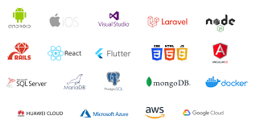

# MICHAEL OUMA

**Full-Stack Developer**

I'm a Full-Stack Developer shaping my own vision of the tech world, one step at a time. I bring ideas to life, crafting projects from the ground up, seamlessly blending planning, design, and problem-solving with code. Beyond functionality, I infuse creativity into every solution, adding artistic touches that make technology both powerful and visually engaging.

### 🧰 Languages and Tools

<table><tr><td valign="top" width="33%">

### Frontend

  
  
  
  
  
  
  
  
  
  
  
  
  
  
  

</td><td valign="top" width="33%">

### Backend

  
  
  
  
  
  
  
  
  
  
  
  
  
  
  

</td><td valign="top" width="33%">

### DevOps

  
  
  
  
  
  
  
  
  
  
  

</td></tr></table>

 

### 💮 Michael Ouma ☀️🚀👩‍💻

- 🔭 I’m currently working to take my backend skills to the next level.  
- 🌱 I’m currently learning to grow my Backend and Database knowledge base with Python & Flask.  
- ❓ Ask me about anything related to Data Structures & Algorithms and related technologies  
- ⚡ Fun fact: Chess and coding share the power of algorithms!

---

## ⚡️ Where to find me

  

  

  

  

  

